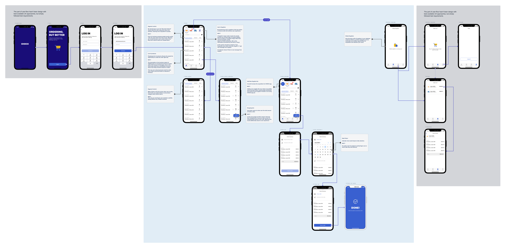

## How to build

1. `git clone https://github.com/valatamanchuk/choco-test.git`
2. `cd choco-test`
3. `pod install` (requires [CocoaPods](https://cocoapods.org))
4. Open `choco-test.xcworkspace` in Xcode.

